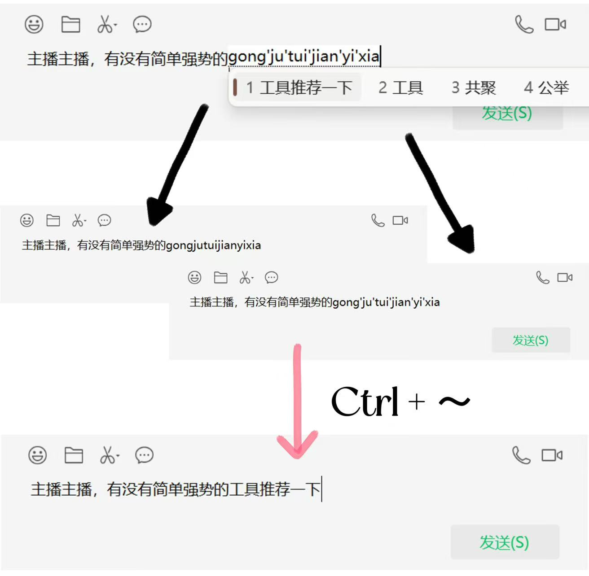

# pyinFix

> 一款实用便捷的中文输入修正工具😋

​	您是否有过输入一长串拼音却误触了Enter键、是否有过中文输入的过程中被优先级更高的弹窗截断，只能删除原始输入从头来过的烦恼！

​	有了pyinFix，只需要简易快捷键 **`Ctrl + ~`** 即可帮你重新完成输入！

> PS: 软件下载在Release中~~~🌹
> PS: 使用时若有将软件转移文件夹的需求，建议生成快捷方式进行移动哟~
>
> 有任何修改意见和反馈都可以与我联系😘
>
> 